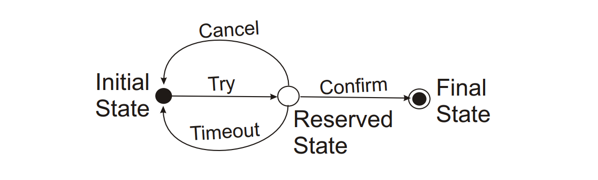

# TCC

在前一篇文章中讲到了[BASE模式][base.md]，这种模式可以应用在单库or跨库事务的场景下。事实上BASE模式不仅仅局限于数据库层面，还可以应用于分布式系统，这类分布式系统最典型的例子就是电商平台，它们有以下几个特征：

1. SOA化/微服务化：单体应用拆分成多个服务。
2. 数据库的各种拆分技术的运用：分表、分库、分区。
3. 大量NoSQL数据库的兴起。
4. 应用之间的通信手段并非直接读数据库：RESTful、RPC、消息中间件等。
5. 大量跨应用事务的出现。

在这种场景下，[2PC][2pc.md]（及XA）已经无法满足需求，因为它：

1. 性能低下，2PC协议是阻塞式的。当协调的数据库越来越多时，性能无法接受。
2. 无法水平扩展以提升性能，只能靠垂直扩展（提升硬件）——更快的CPU、更快更大的硬盘、更大更快的内存——但是这样很贵，并且很容易遇到极限。
3. 染指其他数据库。
4. 依赖于数据库是否支持2PC（XA）。

而BASE只解决最后提交的问题，不能解决诸如在[上一篇文章][base.md]中最后提到的如何保证刷卡消费不透支的问题.于是就有人提出了[TCC模式][presentation-transactions-http-rest]（Try、Confirm、Cancel），这一模式在国内因阿里巴巴的推广而广为人知。

## 协议介绍

在TCC协议里，参与的主体分为两种：

* 发起方：发起事务的应用。
* 参与方：执行事务请求，手上握有资源的服务。

并且有三种动作：Try、Confirm、Cancel。

TCC是Try、Confirm、Cancel的简称，它们分别的职责是：

* Try：负责预留资源（比如新建一条状态=PENDING的订单），同时也做业务检查（比如看看余额是否足够），简单来说就是不能预留已经被占用的资源。
* Confirm：负责落地所预留的资源（比如扣费、把订单状态变成COMPLETED）
* Cancel：负责撤销所预留的资源（比如把订单状态变成CANCELED）

关于预留资源要多说两句，资源都是有限的，因此预留资源都是有时效的，如果当预留资源迟迟得不到Confirm——我们将这种情况称为timeout——参与方会自行将其Cancel（这里有坑，下面会讲）。也就是说参与方对于资源具有自我管理能力，这样可以避免因发起方的问题导致资源被长期占用。

TCC于BASE相比，增加了业务检查和撤销事务的功能。

同时，TCC将2PC数据库层面的动作提升到了服务层面，不同的是TCC的所有动作都是一个本地事务，每个本地事务都在动作完成后commit到数据库：

* Try相当于2PC的Commit request phase，外加了业务检查逻辑
* Confirm相当于2PC的Commit phase的commit动作
* Cancel相当于2PC的Commit phase的rollback动作

## 流程

以下是TCC的状态图：

下面是流程步骤（你会发现和2PC很像）：

1. 【发起方】发送Try到所有参与方
2. 每个【参与方】执行Try，预留资源
3. 【发起方】收到所有【参与方】的Try结果
4. 【发起方】发送Confirm/Cancel到所有参与房
5. 每个【参与方】执行Confirm/Cancel
6. 【发起方】收到所有【参与方】的Confirm/Cancel结果

## 异常处理

从【发起方】的角度来看出现异常要怎么处理：

1. step 1发生异常，【发起方】可以什么都不做等待【参与方】自行Cancel，也可以直接发起Cancel请求
2. step 2、3发生异常，意味着【发起方】没有收到【参与方】的响应，这个时候因认定为失败，执行Cancel
3. step 4发生异常，【发起方】重试Confirm/Cancel
4. step 5、6发生异常，意味着【发起方】没有收到【参与方】的响应，这个时候因认定为失败，重试Confirm/Cancel

从【参与方】角度来看看看出现异常怎么处理：

1. step 1，意味着【参与方】没有收到请求，什么都不需要做
2. step 2，意味着【参与方】没有执行成功，什么都不需要做
3. step 3，意味着【发起方】没有收到结果，什么都不需要做，等待【发起方】重试即可。【参与方】要保证prepare是幂等的。
4. step 4，等待【发起方】重试，或者等待timeout后自行Cancel。
5. step 5，等待【发起方】重试即可
6. step 6，意味着【发起方】没有收到结果，什么都不需要做，等待【发起方】重试即可，【参与方】要保证Confirm/Cancel是幂等的。

观察一下你就会发现TCC和2PC存在一样的问题：

1. 若【发起方】/【参与方】因崩溃遗失了信息，则会造成有的【参与方】已Confirm，有的【参与方】则被Cancel了，甚至于依然保持在预留状态。
2. 若【发起方】在step 4发送Confirm，而【参与方】在Cancel（因timeout导致）。

不过TCC在处理这种情况相比2PC具有一些优势，因为TCC是在服务层面的，当出现这种问题的时候可以很容易通过日志、业务数据排查出来，然后人工介入，而2PC完全是数据库底层的。

## 对于ACID的保证

TCC对于ACID的保证：

* A，正常情况下保证
* C，在某个时间点，会出现A库和B库的数据违反一致性要求的情况，但是最终是一致的
* I，在某个时间点，A事务能够读到B事务部分提交的结果
* D，和本地事务一样，只要commit则数据被持久

## 实现TCC时的注意事项

实现TCC需要关注以下几个方面：

* TCC模式在于服务层面而非数据库层面
* TCC模式依赖于各服务正确实现Try、Confirm、Cancel和timeout处理机制
* TCC模式最少通信次数为2n（n=服务数量）
* 不是所有业务模型都适合使用TCC，比如发邮件业务根本就不需要预留资源
* 需要良好地设计服务的日志、人工处理流程/机制，便于异常情况的处理

## 参考资料

* [Paper - Rest TCC][pdf-tcc]
* [Presentation - Transactions for the REST of Us][presentation-transactions-http-rest]
* [Article - Transactions for the REST of Us][article-transactions-http-rest]
* [Article - Atomic Distributed Transactions: a RESTful Design][article-tcc-wsrest]
* [大规模SOA系统中的分布事务处事_程立][slides-tcc-alibaba] 
* [深入解读微服务架构下分布式事务解决方案][article-microservice-transactions-in-depth]
* [分布式事务之说说TCC事务][article-talk-about-tcc]
* [程立谈大规模SOA系统][video-soa-chengli]

[base.md]: base.md
[2pc.md]: 2pc.md
[presentation-transactions-http-rest]: https://www.infoq.com/presentations/Transactions-HTTP-REST
[article-transactions-http-rest]: https://dzone.com/articles/transactions-for-the-rest-of-us
[pdf-tcc]: http://design.inf.usi.ch/sites/default/files/biblio/rest-tcc.pdf
[slides-tcc-alibaba]: https://wenku.baidu.com/view/be946bec0975f46527d3e104.html
[article-microservice-transactions-in-depth]: https://www.jianshu.com/p/f04cc1a696b4
[article-talk-about-tcc]: https://www.toutiao.com/a6340518979443032322/
[article-tcc-wsrest]: http://www.pautasso.info/biblio-pdf/tcc-wsrest2014.pdf
[video-soa-chengli]: http://www.infoq.com/cn/interviews/soa-chengli